diffusion
===

The Implementation of DIffusion (like) models for fun.

- DDPM([https://arxiv.org/abs/2006.11239](https://arxiv.org/abs/2006.11239))
- Score-SDE([https://arxiv.org/abs/2011.13456](https://arxiv.org/abs/2011.13456))
- Rectified Flow([https://arxiv.org/abs/2209.03003](https://arxiv.org/abs/2209.03003))
- Conditional Flow Matching(Simplified version)([https://arxiv.org/abs/2302.00482](https://arxiv.org/abs/2302.00482))
- Consistency Models([https://arxiv.org/abs/2303.01469](https://arxiv.org/abs/2303.01469))

# Requirements

```sh
pip install torch torchvision einops numpy datasets tqdm scipy omegaconf
```

# Result

- All the datasets are loaded with huggingface/datasets.

- MNIST
    - 20 epoch
    - Unet with 1 up-down block and mid block
- FASHION MNIST
    - 20 epoch
    - Unet with 1 up-down block and mid block
- CIFAR10
    - 100 epoch
    - Unet with 2 up-down block and mid block
- AFHQ - CAT
    - AFHQ dataset filtered with cat label
    - 300 epoch
    - Unet with 2 up-down block and mid block

| Model | MNIST | FASHION MNIST | CIFAR10 | CAT |
| --- | --- | --- | --- | --- |
| DDPM | 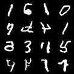 |  | 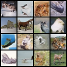 | 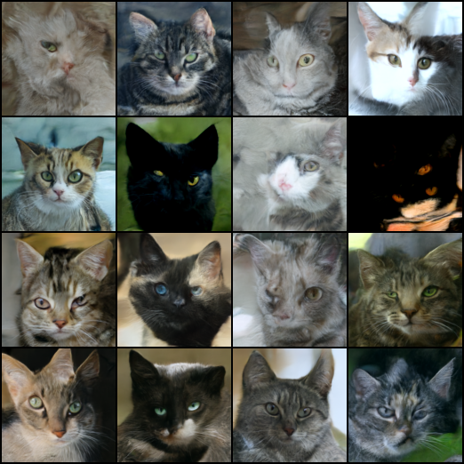 |
| Score-SDE | 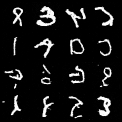 | 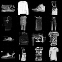 | 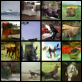 | 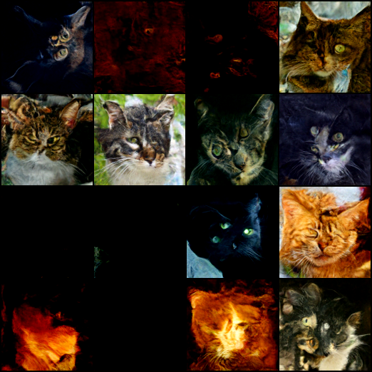 |
| Rectified Flow | 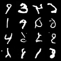 | 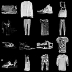 | 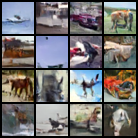 | 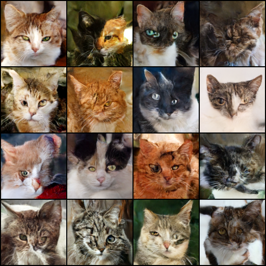 |


- Score-SDE is not stable with regards to color tones in the CAT dataset.
    - Since the previous experiment worked well at times, it may depend on the model size.
    - This phenomenon sometimes occurs in DDPM.
